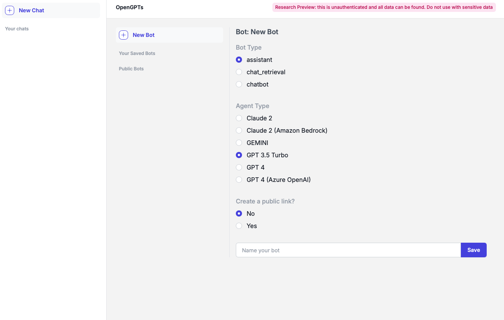

# open-gpts

  

Helm chart to deploy the open-gpts application and all services it depends on.

## Deploying OpenGPTs with Helm

### Prerequisites

Ensure you have the following tools/items ready.

1. A working Kubernetes cluster that you can access via `kubectl`
    1. Recommended: Atleast 1 vCPUs, 4GB Memory available
        1. You may need to tune resource requests/limits for all of our different services based off of organization size/usage
    2. Valid Dynamic PV provisioner or PVs available on your cluster. You can verify this by running:

        ```jsx
        kubectl get storageclass
        ```
2. `Helm`
    1. `brew install helm`
3. SSL(optional)
    1. This should be attachable to a load balancer that the chart will provision
4. API Keys(optional).
    1. Used by various SDKS. Configure based on the tools you are using.
5. External Redis(optional).
    1. You can configure external redis using the `values.yaml` file. You will need to provide a connection url for your redis instance.
    2. Currently, we do not support using Redis with TLS. We will be supporting this shortly.
    3. We only official support Redis versions >= 6.
    4. We rely on the vector store module for Redis. Ensure that your Redis instance has this module installed.

### Configure your Helm Charts:

1. Create a copy of `values.yaml`
2. Override any values in the file. Refer to the `values.yaml` documentation below to see all configurable values. Some values we recommend tuning:
    1. Resources
    2. SSL
        1. Add an annotation to the `backend.service` object to tell your cloud provider to provision a load balancer with said certificate attached.
        2. This will vary based on your cloud provider. Refer to their documentation for more information.
        3. To support the above, we e
    3. Api Keys
    4. Images

Bare minimum config file `open_gpts_config.yaml`:

```yaml
config:
  openaiApiKey: "foo"
  tavilyApiKey: "foo"
  kayApiKey: "foo"
  ydcApiKey: "foo"
```

Example `EKS` config file with certificates setup using ACM:

```jsx
config:
  openaiApiKey: "foo"
  tavilyApiKey: "foo"
  kayApiKey: "foo"
  ydcApiKey: "foo"

backend:
  service:
    annotations:
      service.beta.kubernetes.io/aws-load-balancer-type: "nlb"
      service.beta.kubernetes.io/aws-load-balancer-ssl-ports: "https"
      service.beta.kubernetes.io/aws-load-balancer-ssl-cert: "<certificate arn>"
```

Example config file with external redis:

```jsx
config:
  openaiApiKey: "foo"
  tavilyApiKey: "foo"
  kayApiKey: "foo"
  ydcApiKey: "foo"
redis:
  external:
    enabled: true
    connectionUrl: "redis://<url>:6379"
```

You can also use existingSecretName to avoid checking in secrets. This secret will need to follow
the same format as the secret in the corresponding `secrets.yaml` file.

### Deploying to Kubernetes:

1. Verify that you can connect to your Kubernetes cluster(note: We highly suggest installing into an empty namespace)
    1. Run `kubectl get pods`

        Output should look something like:

        ```bash
        kubectl get pods
        No resources found in default namespace.
        ```

2. Ensure you have the Langchain Helm repo added. (skip this step if you are using local charts)

        helm repo add langchain https://langchain-ai.github.io/helm/
        "langchain" has been added to your repositories

3. Run `helm install open-gpts langchain/open-gpts --values open_gpts_config.yaml`
4. Run `kubectl get pods`
    1. Output should now look something like:

    ```bash
    NAME                                 READY   STATUS    RESTARTS      AGE
    open-gpts-backend-849c5c49bd-5hrth   1/1     Running   0             3m17s
    open-gpts-redis-0                    1/1     Running   0             3m17s
    ```

### Validate your deployment:

1. Run `kubectl get services`

    Output should look something like:

    ```bash
    NAME                TYPE           CLUSTER-IP       EXTERNAL-IP                                                               PORT(S)        AGE
    open-gpts-backend   LoadBalancer   172.20.158.106   <ip>                                                                      80:31767/TCP   7m22s
    open-gpts-redis     ClusterIP      172.20.181.57    <none>                                                                    6379/TCP       7m22s
    ```

3. Visit the external ip for the `open-gpts-backend` service on your browser

    The Open-GPTs UI should be visible/operational

    

## FAQ:

1. How can we upgrade our application?
    - To upgrade, you will need to follow the upgrade instructions in the Helm README and run a `helm upgrade open-gpts --values <values file>`
2. How can we backup our application?
    - Currently, we rely on PVCs/PV to power storage for our application. We strongly encourage setting up `Persistent Volume` backups or moving to a managed service for `Redis` to support disaster recovery
3. How does load balancing work/ingress work?
    - Currently, our application spins up one load balancer using a k8s service of type `LoadBalancer` for our frontend. If you do not want to setup a load balancer you can simply port-forward the frontend and use that as your external ip for the application.
    - We also have an option for the chart to provision an ingress resource for the application.
4. How can we authenticate to the application?
    - Currently, we do not support auth.
5. How can I use External `Redis`?
    - You can configure external redis using the external sections in the `values.yaml` file. You will need to provide the connection url/params for the redis instance. Look at the configuration above example for more information.
6. What networking configuration is needed  for the application?
    - Our deployment only needs egress for a few things:
        - Fetching images (If mirroring your images, this may not be needed)
        - Talking to any LLMs
    - Your VPC can set up rules to limit any other access.
7. What resources should we allocate to the application?
    - We recommend at least 4 vCPUs and 16GB of memory for our application.
    - We have some default resources set in our `values.yaml` file. You can override these values to tune resource usage for your organization.
    - If the metrics server is enabled in your cluster, we also recommend enabling autoscaling on all deployments.

## General parameters

| Key | Type | Default | Description |
|-----|------|---------|-------------|
| commonAnnotations | object | `{}` | Annotations that will be applied to all resources created by the chart |
| commonLabels | object | `{}` | Labels that will be applied to all resources created by the chart |
| fullnameOverride | string | `""` | String to fully override `"openGPTs.fullname"` |
| images.backendImage.pullPolicy | string | `"Always"` |  |
| images.backendImage.repository | string | `"docker.io/langchain/open-gpts"` |  |
| images.backendImage.tag | string | `"daf9aba"` |  |
| images.imagePullSecrets | list | `[]` | Secrets with credentials to pull images from a private registry. Specified as name: value. |
| images.redisImage.pullPolicy | string | `"IfNotPresent"` |  |
| images.redisImage.repository | string | `"docker.io/redis/redis-stack-server"` |  |
| images.redisImage.tag | string | `"latest"` |  |
| images.registry | string | `""` | If supplied, all children <image_name>.repository values will be prepended with this registry name + `/` |
| ingress.annotations | object | `{}` |  |
| ingress.enabled | bool | `false` |  |
| ingress.hostname | string | `""` |  |
| ingress.ingressClassName | string | `""` |  |
| ingress.labels | object | `{}` |  |
| ingress.tls | list | `[]` |  |
| nameOverride | string | `""` | Provide a name in place of `open-gpts` |

## Configs

| Key | Type | Default | Description |
|-----|------|---------|-------------|
| config.azureOpenaiApiBase | string | `"placeholder"` |  |
| config.azureOpenaiApiKey | string | `"placeholder"` |  |
| config.azureOpenaiApiVersion | string | `"placeholder"` |  |
| config.azureOpenaiDeploymentName | string | `"placeholder"` |  |
| config.conneryRunnerApiKey | string | `"placeholder"` |  |
| config.conneryRunnerUrl | string | `"https://your-personal-connery-runner-url"` |  |
| config.existingSecretName | string | `""` |  |
| config.kayApiKey | string | `"placeholder"` |  |
| config.openaiApiKey | string | `""` |  |
| config.robocorpActionServerKey | string | `"dummy-api-key"` |  |
| config.robocorpActionServerUrl | string | `"https://dummy-action-server.robocorp.link"` |  |
| config.tavilyApiKey | string | `"placeholder"` |  |
| config.ydcApiKey | string | `"placeholder"` |  |

## Backend

| Key | Type | Default | Description |
|-----|------|---------|-------------|
| backend.autoscaling.enabled | bool | `false` |  |
| backend.autoscaling.maxReplicas | int | `5` |  |
| backend.autoscaling.minReplicas | int | `1` |  |
| backend.autoscaling.targetCPUUtilizationPercentage | int | `80` |  |
| backend.containerPort | int | `8000` |  |
| backend.deployment.affinity | object | `{}` |  |
| backend.deployment.annotations | object | `{}` |  |
| backend.deployment.extraEnv | list | `[]` |  |
| backend.deployment.labels | object | `{}` |  |
| backend.deployment.nodeSelector | object | `{}` |  |
| backend.deployment.podSecurityContext | object | `{}` |  |
| backend.deployment.replicaCount | int | `1` |  |
| backend.deployment.resources | object | `{}` |  |
| backend.deployment.securityContext | object | `{}` |  |
| backend.deployment.sidecars | list | `[]` |  |
| backend.deployment.tolerations | list | `[]` |  |
| backend.deployment.volumeMounts | list | `[]` |  |
| backend.deployment.volumes | list | `[]` |  |
| backend.migrations.affinity | object | `{}` |  |
| backend.migrations.annotations | object | `{}` |  |
| backend.migrations.enabled | bool | `true` |  |
| backend.migrations.extraEnv | list | `[]` |  |
| backend.migrations.labels | object | `{}` |  |
| backend.migrations.nodeSelector | object | `{}` |  |
| backend.migrations.podSecurityContext | object | `{}` |  |
| backend.migrations.replicaCount | int | `1` |  |
| backend.migrations.resources | object | `{}` |  |
| backend.migrations.securityContext | object | `{}` |  |
| backend.migrations.sidecars | list | `[]` |  |
| backend.migrations.tolerations | list | `[]` |  |
| backend.migrations.volumeMounts | list | `[]` |  |
| backend.migrations.volumes | list | `[]` |  |
| backend.name | string | `"backend"` |  |
| backend.service.annotations | object | `{}` |  |
| backend.service.httpPort | int | `80` |  |
| backend.service.httpsPort | int | `443` |  |
| backend.service.labels | object | `{}` |  |
| backend.service.loadBalancerIP | string | `""` |  |
| backend.service.loadBalancerSourceRanges | list | `[]` |  |
| backend.service.type | string | `"LoadBalancer"` |  |
| backend.serviceAccount.annotations | object | `{}` |  |
| backend.serviceAccount.create | bool | `true` |  |
| backend.serviceAccount.labels | object | `{}` |  |
| backend.serviceAccount.name | string | `""` |  |

## Redis

| Key | Type | Default | Description |
|-----|------|---------|-------------|
| redis.containerPort | int | `6379` |  |
| redis.external.connectionUrl | string | `""` |  |
| redis.external.enabled | bool | `false` |  |
| redis.external.existingSecretName | string | `""` |  |
| redis.name | string | `"redis"` |  |
| redis.service.annotations | object | `{}` |  |
| redis.service.labels | object | `{}` |  |
| redis.service.loadBalancerIP | string | `""` |  |
| redis.service.loadBalancerSourceRanges | list | `[]` |  |
| redis.service.port | int | `6379` |  |
| redis.service.type | string | `"ClusterIP"` |  |
| redis.serviceAccount.annotations | object | `{}` |  |
| redis.serviceAccount.create | bool | `true` |  |
| redis.serviceAccount.labels | object | `{}` |  |
| redis.serviceAccount.name | string | `""` |  |
| redis.statefulSet.affinity | object | `{}` |  |
| redis.statefulSet.annotations | object | `{}` |  |
| redis.statefulSet.extraEnv | list | `[]` |  |
| redis.statefulSet.labels | object | `{}` |  |
| redis.statefulSet.nodeSelector | object | `{}` |  |
| redis.statefulSet.persistence.size | string | `"8Gi"` |  |
| redis.statefulSet.persistence.storageClassName | string | `""` |  |
| redis.statefulSet.podSecurityContext | object | `{}` |  |
| redis.statefulSet.resources | object | `{}` |  |
| redis.statefulSet.securityContext | object | `{}` |  |
| redis.statefulSet.sidecars | list | `[]` |  |
| redis.statefulSet.tolerations | list | `[]` |  |
| redis.statefulSet.volumeMounts | list | `[]` |  |
| redis.statefulSet.volumes | list | `[]` |  |

## Maintainers

| Name | Email | Url |
| ---- | ------ | --- |
| Ankush | <ankush@langchain.dev> |  |

----------------------------------------------
Autogenerated from chart metadata using [helm-docs v1.14.2](https://github.com/norwoodj/helm-docs/releases/v1.14.2)
## Docs Generated by [helm-docs](https://github.com/norwoodj/helm-docs)
`helm-docs -t ./charts/opengpts/README.md.gotmpl`
